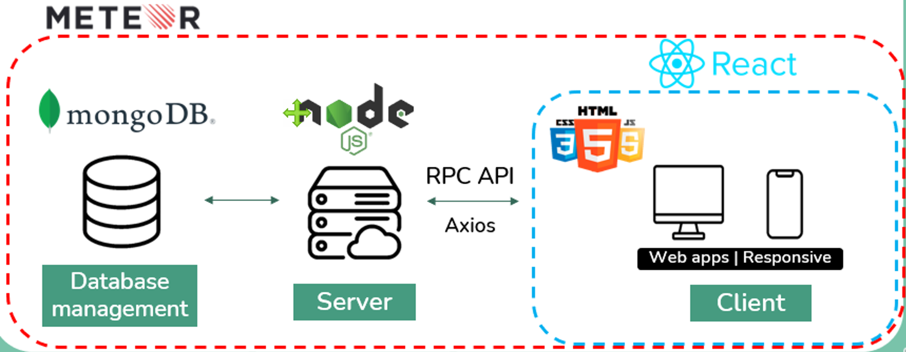

# Online Bus Reservation System
lorem 

### System Overview
  

### Database Diagram
  

### Use Cases by User Role
  

## User Interface
lorem

## E2E testing
lorem

## For Developers
### Installation
Step1: `$ git clone https://github.com/Senior-Project-OBRS/supreme-pancake.git`  
Step2: `$ meteor npm install --save`  

### Build
Step1: create settings.json in the root directory with the following parameters  
Step2: `$ meteor run --settings settings.json` 

### Run Testing
- full-app tests `$ meteor test --full-app --driver-package meteortesting:mocha --port 3100`
- unit tests `$ meteor test --driver-package meteortesting:mocha --port 3100`

### Deploy
`$ meteor deploy nj-phuyaipu.meteorapp.com --free --mongo --settings settings.json`