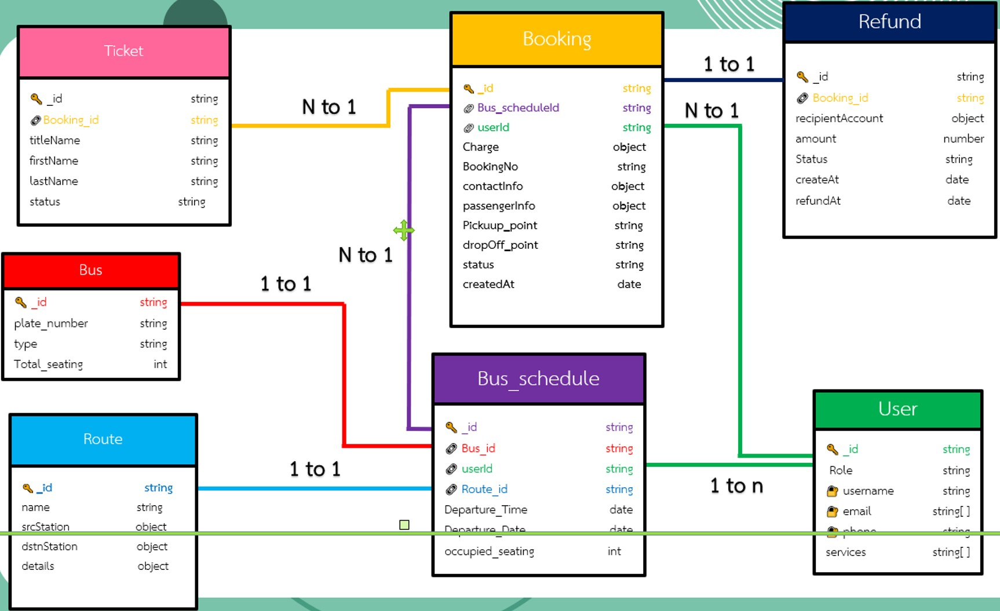
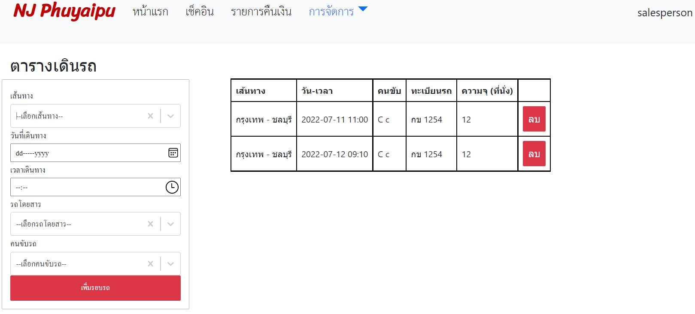

# Online Bus Reservation System
เนื่องจากการเปิดรับจองตั๋วรถผ่านทาง Facebook Fanpage ทำให้ทุกครั้งที่ลูกค้า inbox เข้ามา พนักงานขายตั๋วโดยสารจะมีขั้นตอนการทำงาน ดังนี้
1. แจ้งรอบรถที่เปิดให้บริการ
2. ตรวจสอบข้อมูลการเดินทางของผู้โดยสาร
3. ตรวจสอบยอดการชำระเงิน (โอนเงิน)
4. นำข้อมูลการเดินทางของผู้โดยสาร ลงในเว็บขายตั๋วรถออนไลน์
5. ส่งรูปตั๋วให้ลูกค้า

ระบบจองตั๋วรถออนไลน์นี้ จึงมีวัตถุประสงค์เพื่อลดภาระงานของพนักงานขายตั๋วโดยสาร และอำนวยความสะดวกในการจองตั๋วของลูกค้า โดยเฉพาะอย่างยิ่งในกรณีที่มีลูกค้าหลายคน inbox เข้ามาใน Facebook Fanpage พร้อมกัน 

### System Overview
  

### Database Diagram
  

### Use Cases by User Role
  

## User Interface
### Customer
#### 1. จองตั๋ว
  

#### 1.1 ชำระโดย Credit/Debit card
  

#### 1.2 ชำระโดย iBanking
  

  

#### 1.3 ชำระโดย PromptPay
  

เมื่อชำระเงินเรียบร้อยแล้ว จะได้รับ sms  
  

#### 2. เลื่อนตั๋ว

#### 3. ยกเลิกตั๋ว

#### 4. แสดง E-ticket

#### 5. เช็คอิน

### Salesperson
#### 1. เพิ่ม-ลบ รถโดยสาร
  

#### 2. เพิ่ม-ลบ เส้นทาง
  

#### 3. แก้ไขค่าโดยสาร และเวลาในการเดินทาง
  

#### 4. เพิ่ม-ลบ ตารางเดินรถ
  

#### 5. ตรวจสอบรอบรถ และยกเลิการจอง
  

#### 6. เช็คอินให้ผู้โดยสาร
 &nbsp;
  

#### 7. ตรวจสอบการคืนเงิน
  

### Driver
#### 1. ตารางขับรถ
  

#### 2. เช็คอินให้ผู้โดยสาร
 &nbsp;
  

### Admin
#### 1. แก้ไขบทบาทผู้ใช้ และ 2. ลบผู้ใช้งาน
  

## E2E testing
lorem

## For Developers
### Installation
Step1: `$ git clone https://github.com/Senior-Project-OBRS/supreme-pancake.git`  
Step2: `$ meteor npm install --save`  

### Build
Step1: create settings.json in the root directory with the following parameters  
Step2: `$ meteor run --settings settings.json` 

### Run Testing
- full-app tests `$ meteor test --full-app --driver-package meteortesting:mocha --port 3100`
- unit tests `$ meteor test --driver-package meteortesting:mocha --port 3100`

### Deploy
`$ meteor deploy nj-phuyaipu.meteorapp.com --free --mongo --settings settings.json`